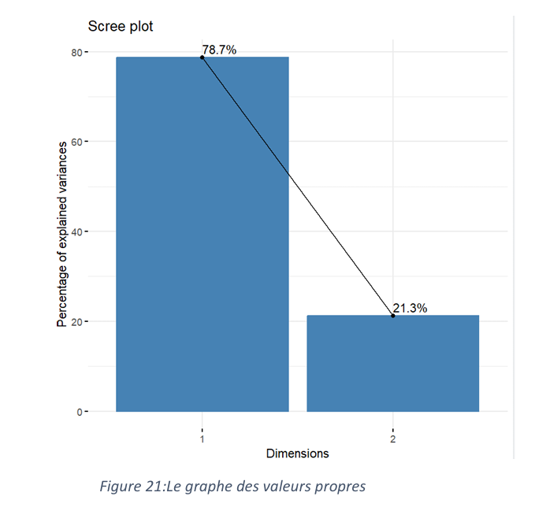

<div align="center">

# ⚽ FIFA World Cup Analysis using Correspondence Analysis (AFC)

### 📊 Statistical Exploration of National Team Performance in FIFA World Cup History

<p align="center">
  
  
  
  
  
</p>

</div>

---

# 📌 Overview

This project analyzes the historical performance of national football teams in the **FIFA World Cup (up to 2022)** using **Correspondence Analysis (AFC)** and statistical methods.

The objective is to explore hidden relationships between:

- ⚽ National teams
- 🏆 Match outcomes
- 📊 Performance patterns

The analysis combines:

- Exploratory Data Analysis (EDA)
- Chi-square statistical testing
- Correspondence Analysis (AFC)
- Data visualization techniques

to uncover meaningful insights about team performance and competition dynamics.

---

# 🎯 Project Objectives

- Perform Exploratory Data Analysis (EDA)
- Analyze relationships between teams and results
- Apply Chi-square statistical testing
- Perform Correspondence Analysis (AFC)
- Visualize multidimensional relationships
- Extract meaningful football performance insights

---

# 📊 Dataset Description

The dataset contains historical FIFA World Cup team performance statistics.

### Variables

| Variable | Description |
|---|---|
| Team | National football team |
| W | Number of wins |
| D | Number of draws |
| L | Number of losses |

---

# 🚀 Main Features

✅ Exploratory Data Analysis (EDA)  
✅ Statistical hypothesis testing  
✅ Chi-square independence analysis  
✅ Correspondence Analysis (AFC)  
✅ Team performance visualization  
✅ Biplot representation  
✅ Bubble chart visualization  
✅ Statistical interpretation of football data  

---

# 🛠️ Technologies Used

| Category | Technologies |
|---|---|
| Programming Language | Python |
| Statistical Analysis | R |
| Data Visualization | Matplotlib, Seaborn |
| AFC Libraries | FactoMineR, factoextra |
| Spreadsheet Analysis | Excel, XLSTAT |
| Data Processing | Pandas, NumPy |

---

# 🧠 Statistical Workflow

<div align="center">

```text
Data Collection
      ↓
Data Cleaning
      ↓
Exploratory Data Analysis
      ↓
Contingency Table Construction
      ↓
Chi-Square Test
      ↓
Correspondence Analysis (AFC)
      ↓
Visualization & Interpretation
```

</div>

---

# 📂 Project Structure

```bash
fifa-world-cup-afc-analysis/
│
├── data/
│   └── donnees_nettoyees_Coupe_du_monde.xlsx
│
├── notebooks/
│   └── afc_analysis.ipynb
│
├── report/
│   └── AFC_Project_Report.pdf
│
├── visuals/
│   ├── scree_plot.png
│   ├── biplot.png
│   ├── colored_points.png
│   └── bubble_chart.png
│
├── README.md
└── requirements.txt
```

---

# 📸 Visualizations

## 📈 Scree Plot

<p align="center">
  
</p>

---

## ⚽ AFC Biplot

<p align="center">
  
</p>

---

## 🎨 Colored Team Representation

<p align="center">
  
</p>

---

## 🫧 Contingency Bubble Chart

<p align="center">
  
</p>

---

# ⚙️ Installation

## 1️⃣ Clone the Repository

```bash
git clone https://github.com/Souadzriouil/fifa-world-cup-afc-analysis.git
cd fifa-world-cup-afc-analysis
```

---

## 2️⃣ Install Python Dependencies

```bash
pip install -r requirements.txt
```

---

## 3️⃣ Run the Notebook

```bash
jupyter notebook
```

Open:

```bash
notebooks/afc_analysis.ipynb
```

---

# 📈 Statistical Analysis

## 🔹 Chi-Square Test

The Chi-square test was used to evaluate whether team performance variables are statistically dependent.

---

## 🔹 Correspondence Analysis (AFC)

AFC was applied to:

- Reduce dimensionality
- Identify team clusters
- Visualize relationships between teams and outcomes
- Detect performance similarities

---

# 💡 Key Insights

- Strong teams tend to cluster around higher win frequencies
- Some teams exhibit balanced performance profiles
- AFC visualization reveals hidden competition structures
- Performance relationships become easier to interpret visually

---

# 🧪 Potential Use Cases

This analysis framework can be adapted for:

- Sports analytics
- Football performance evaluation
- Statistical education
- Data visualization learning
- Multivariate statistical analysis

### Benefits

✅ Better understanding of team performance  
✅ Visual interpretation of football statistics  
✅ Practical application of AFC methodology  
✅ Statistical insight extraction  

---

# 🔮 Future Improvements

- [ ] Add interactive dashboards
- [ ] Analyze player-level statistics
- [ ] Integrate machine learning prediction models
- [ ] Expand dataset with recent tournaments
- [ ] Add World Cup trend forecasting
- [ ] Build Power BI dashboard version

---

# 👩‍💻 Author

<div align="center">

## Souad Zriouil

### AI Engineer | Data Scientist | Machine Learning | NLP | LLM

<p align="center">
  <a href="https://github.com/Souadzriouil">
    
  </a>

  <a href="https://www.linkedin.com/in/souad-zriouil-54b19b267">
    
  </a>
</p>

</div>

---

# ⭐ Support

If you find this project useful:

- ⭐ Star the repository
- 🔄 Share it on LinkedIn
- 📌 Add it to your portfolio

<div align="center">

⭐ Star the repo if you like the project!

</div>

---

# 📜 License

This project is intended for educational and research purposes.
